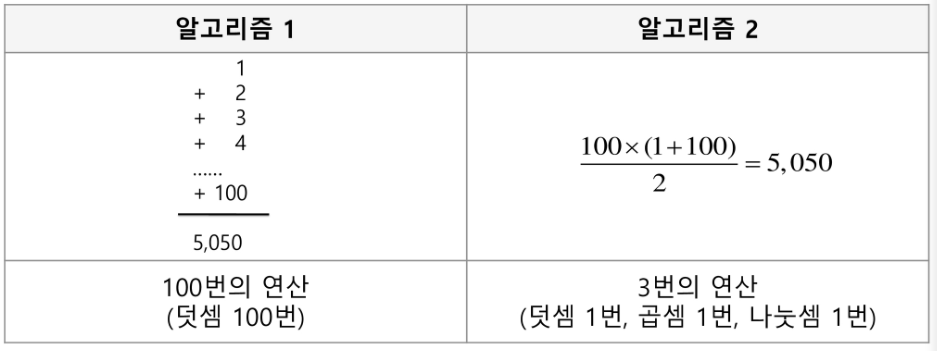

> 복잡도(complexity)는 문제를 해결하거나, 알고리즘을 실행하는데 필요한 메모리, 시간, messages 등과 같은 리소스의 본질적인 최소량이다.
>
> 공간 복잡도(space complexity)는 알고리즘을 실행하는 데 필요한 메모리의 총량을,
>
> 시간 복잡도(time complexity)는 알고리즘을 실행하는 데 필요한 시간(=연산 횟수)의 총량을 의미한다.

## 알고리즘의 성능 측정

### 성능 측정을 왜 하는가?

주어진 문제를 해결하기 위해 여러 개의 다양한 알고리즘을 사용할 수 있다. 특정 알고리즘이 모든 부분에 있어서 항상 가장 뛰어나다고 할 수 없으며, 때문에 다른 알고리즘과의 성능 분석이 필요하다.  => 즉, **어떤 상황에서 어떤 알고리즘을 사용해야 하는가?** 를 생각해 볼 수 있다.

### 어떻게 성능 분석을 하는가?

성능 분석을 하는 기준으로 1. 알고리즘의 `작업량`(=시간복잡도)과 2. 알고리즘의 `메모리 양`(=공간복잡도)을 비교한다.

ex) 1부터 100까지의 합

알고리즘 1 보다 알고리즘 2가 훨씬 적은 작업량을 수행한다.  => 따라서 알고리즘 2가 성능이 더 좋다.

## 시간 복잡도(Time Complexity)

시간 복잡도란 **알고리즘의 작업량을 표현하는 방식**이다. 실제 걸리는 시간을 측정하는 방식을 대략적으로 측정할 수 있으며, 실제 걸리는 시간은 보다 적을 수 있다.

알고리즘의 크기가 무한대로 갈 때를 가정으로 한다. => 최악의 경우(Worst case)를 가정으로 하고 알고리즘의 성능을 파악한다.

일반적으로 빅오 표기법(big-O notation)으로 표시된다.

**실행되는 명령문의 개수를 계산**하면 비교적 간단하게 구할 수 있다.

   

## 공간 복잡도(Space Complexity)

공간 복잡도란 **알고리즘의 메모리 양을 표현하는 방식**이다. 실제 사용되는 메모리를 대략적으로 측정한다.

시간 복잡도와 마찬가지로, 알고리즘의 크기가 무한대로 갈 때를 가정으로 한다.

일반적으로 빅오 표기법으로 표시된다.

##### 추가

빅오 표기법에 대해서는 다음 글에서 설명한다.

### Ref

[NIST - Dictionary of Algorithms and Data Structures](<https://xlinux.nist.gov/dads/>)

[빅오 표기법 (Big-O Notation), 시간 복잡도, 공간 복잡도](<https://cjh5414.github.io/big-o-notation/>)

